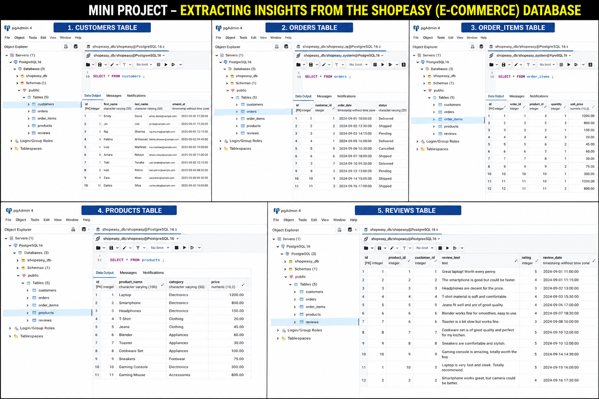
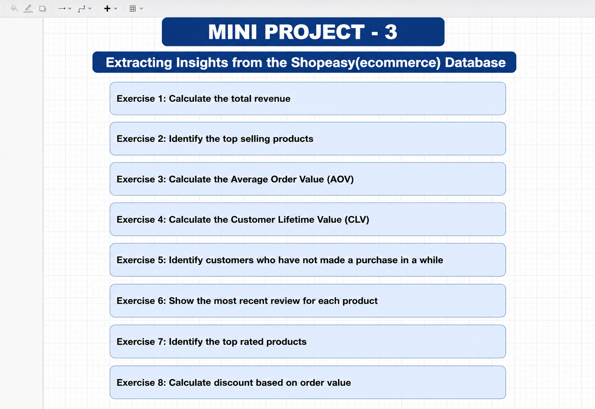
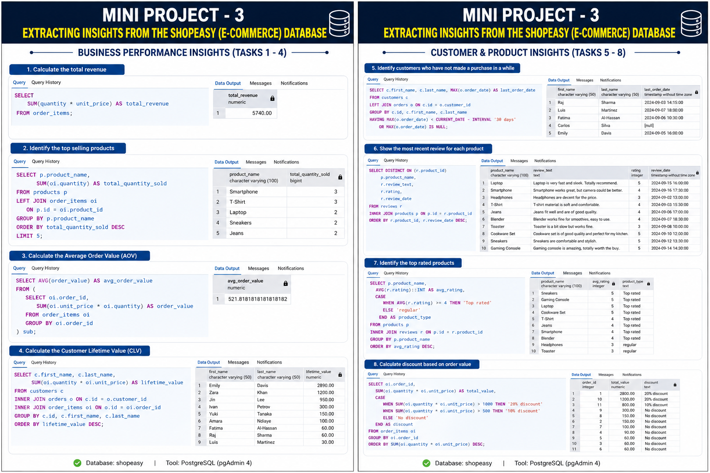

# 🛒 Shopeasy E-Commerce SQL Analysis Project

## 📌 Project Overview

This project demonstrates SQL-based business analysis using a Shopeasy E-Commerce database built in PostgreSQL.

The database contains customer, product, order, and review information which is analyzed to generate meaningful business insights.

---

## 🛠 Tools Used

- PostgreSQL
- pgAdmin 4
- SQL
- GitHub

---

## 🗄 Database Structure

---

## 📊 Business Questions Solved

1. Calculate Total Revenue
2. Identify Top Selling Products
3. Calculate Average Order Value (AOV)
4. Calculate Customer Lifetime Value (CLV)
5. Identify Customers Who Have Not Purchased Recently
6. Show Most Recent Review For Each Product
7. Identify Top Rated Products
8. Calculate Discount Based On Order Value

---

## 📈 Analysis Results

---

## 🔥 SQL Concepts Used

- SELECT
- WHERE
- GROUP BY
- ORDER BY
- JOINS
- Aggregate Functions
- CASE Statements
- Subqueries
- Customer Analytics
- Product Analytics

---

## 🎯 Key Insights

- Total Revenue Generated: 5740
- Smartphone and T-Shirt were top-selling products.
- Average Order Value (AOV): 521.82
- Emily Davis had the highest Customer Lifetime Value.
- Multiple products achieved top-rated status.
- Discount logic was implemented using CASE statements.

---

## 👨‍💻 Author

Hari Chandra Prasad

MBA (Business Analytics)

GitHub: https://github.com/hari768
